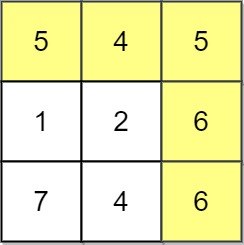
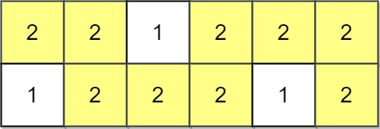
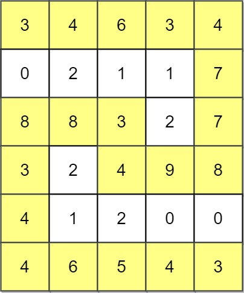

Medium

Given an `m x n` integer matrix `grid`, return _the maximum **score** of a path starting at_ `(0, 0)` _and ending at_ `(m - 1, n - 1)` moving in the 4 cardinal directions.

The **score** of a path is the minimum value in that path.

- For example, the score of the path `8 → 4 → 5 → 9` is `4`.

**Example 1:**



```
Input: grid = [[5,4,5],[1,2,6],[7,4,6]]
Output: 4
Explanation: The path with the maximum score is highlighted in yellow.
```

**Example 2:**



```
Input: grid = [[2,2,1,2,2,2],[1,2,2,2,1,2]]
Output: 2
```

**Example 3:**



```
Input: grid = [[3,4,6,3,4],[0,2,1,1,7],[8,8,3,2,7],[3,2,4,9,8],[4,1,2,0,0],[4,6,5,4,3]]
Output: 3
```

**Constraints:**

- `m == grid.length`
- `n == grid[i].length`
- `1 <= m, n <= 100`
- `0 <= grid[i][j] <= 10^9`

**Companies**: Google, Facebook, Amazon
**Related Topics**: Array, Depth-First Search, Breadth-First Search, Union Find, Heap (Priority Queue), Matrix
