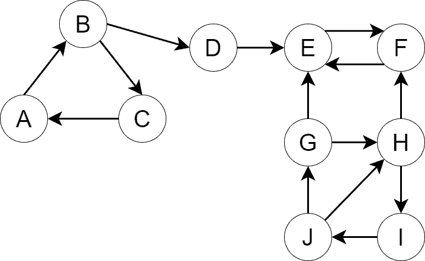
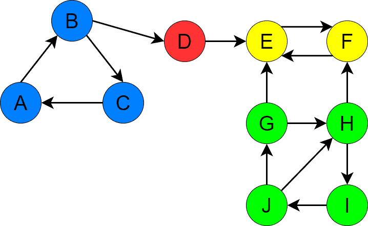
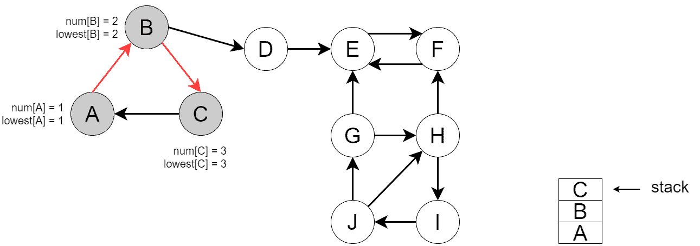
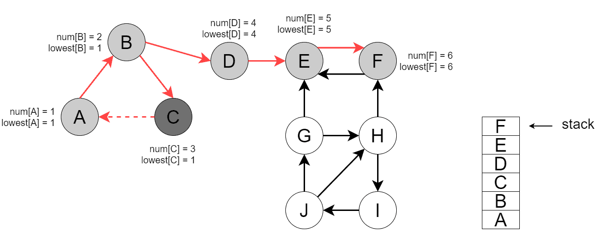
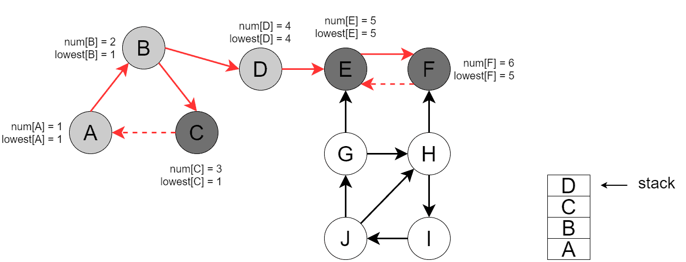
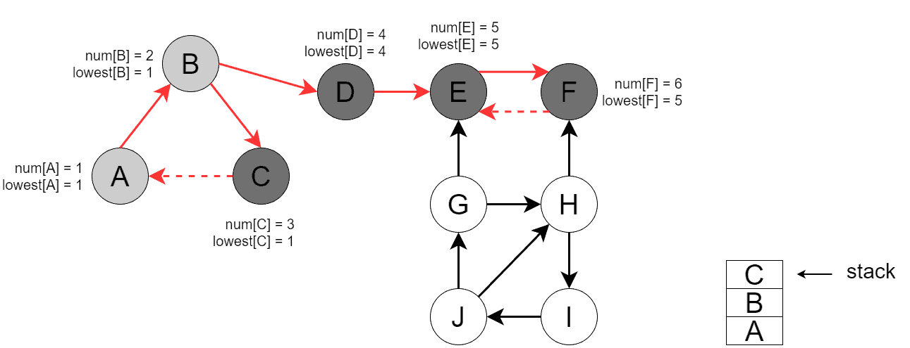
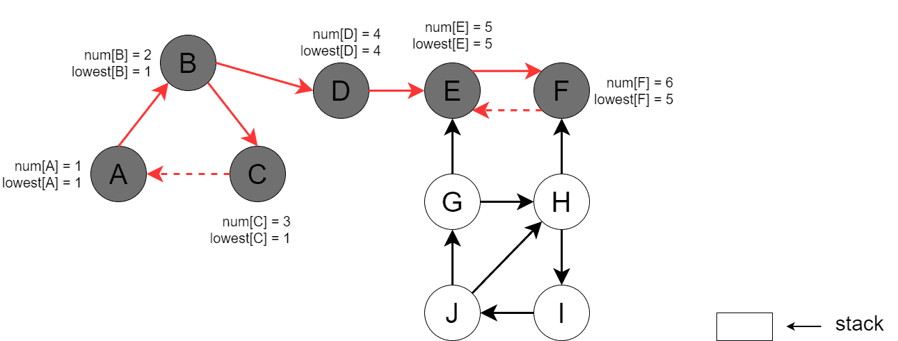
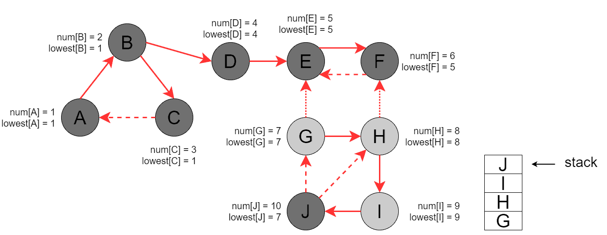
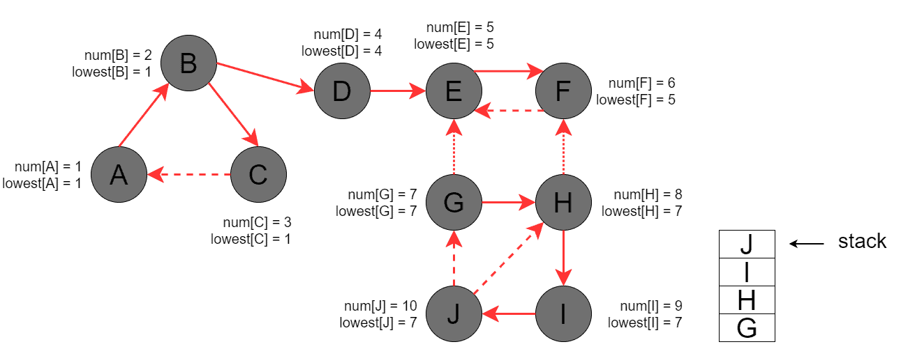

## 1. Introduction[](https://www.baeldung.com/cs/scc-tarjans-algorithm#introduction)

In this topic, we’ll discuss Tarjan’s algorithm for finding strongly connected components (SCCs) in directed graphs. Furthermore, we can check out [Kosaraju’s algorithm](https://www.baeldung.com/cs/kosaraju-algorithm-scc) for the definition of SCCs to start.

## 2. An Example Graph[](https://www.baeldung.com/cs/scc-tarjans-algorithm#an-example-graph)

Let’s pick an example graph, , for our discussion:



 is a directed graph with four SCCs. We’ve depicted the SCCs with different colors for visual comprehension:



Further, we’ll use this graph to demonstrate the ideas of Tarjan’s algorithm.

## 3. The Spanning Forest of DFS[](https://www.baeldung.com/cs/scc-tarjans-algorithm#the-spanning-forest-of-dfs)

**Before digging into the algorithm itself, we need to introduce the notion of the DFS spanning forest**. Hence, when DFS traverses a directed graph, it defines a set of non-intersecting trees. We’ll call this set the spanning forest of DFS.

**Additionally, we’ll also classify the edges of the graph depending on how DFS discovers them**. If DFS processes vertex  it discovers:

- An unvisited neighbour, , then edge (, ) is a tree edge.
- A visited but not yet fully processed neighbor, , then edge (, ) is a back edge.
- A fully processed neighbour, , then edge (, ) is a cross edge.

Let’s classify the edges of the sample graph. First, we run DFS for vertex . DFS visits vertices , , , , ,  and exits. Then, let’s run DFS for . Now, DFS visits the remaining vertices: , , , and . Moreover, The tree edges are depicted with solid lines, the back edges with dashed lines, and the cross edges with dotted lines:


The spanning forest of the graph consists of two trees:

- The first tree consists of the set of vertices  and the set of edges .
- The second tree consists of the set of vertices  and the set of edges .

Note that depending on which vertex we start DFS for, the classification of edges may change. For example, some back edges may become tree edges and vice versa, and some cross edges may become tree edges. Thus, the tree set in the spanning forest may also change. Fortunately, that doesn’t affect Tarjan’s algorithm in any way.

## 4. Tarjan’s Algorithm[](https://www.baeldung.com/cs/scc-tarjans-algorithm#tarjans-algorithm)

### 4.1. Observations[](https://www.baeldung.com/cs/scc-tarjans-algorithm#1-observations)

**Tarjan’s algorithm uses the observation that SCCs can be built out of the trees in the spanning forest**. **Furthermore, a single tree in the spanning forest may contain several SCCs, but no SCC can belong to more than one tree**. If an SCC belonged to more than one tree, then those trees would have been reachable from each other during DFS traversal, thus forming a single tree.

If each SCC exactly matched a tree in the spanning forest, the problem of finding SCCs would have been solved by running a simple DFS and identifying trees in the spanning forest. However, this approach only works for finding connected components in undirected graphs. In the case of directed graphs, a tree in the spanning forest may contain multiple SCCs.

Let’s pay attention to another observation that is used by the algorithm. In particular, any SCC can be treated as a directed cycle because any two vertices in an SCC are reachable from each other. Hence, **if we start DFS for any of the SCC vertices, there will be a moment when DFS sees a back edge to that vertex**. A back edge identifies a cycle. Thus, when we see a back edge during DFS, we conclude that either we’ve found an SCC or a small cycle inside of a bigger cycle.

### 4.2. Algorithm Description[](https://www.baeldung.com/cs/scc-tarjans-algorithm#2-algorithm-description)

**Tarjan’s algorithm defines arrays ![\boldsymbol{num[]}](https://www.baeldung.com/wp-content/ql-cache/quicklatex.com-d23d39ecb7524c58f27a2422fea19e13_l3.svg "Rendered by QuickLaTeX.com") and ![\boldsymbol{lowest[]}](https://www.baeldung.com/wp-content/ql-cache/quicklatex.com-58d9cceb2ee246ca3cd249ed2e254c70_l3.svg "Rendered by QuickLaTeX.com"), which help in classifying edges**. Furthermore, they help identify the starting vertex of an SCC. Additionally, the algorithm also uses a stack to keep the current DFS tree’s vertices and correctly fetches the vertices of SCCs afterward.

The steps of the algorithm are described below:

1. Select an unvisited vertex, . Furthermore, if there’re no unvisited vertices, the algorithm terminates
2. Run DFS for 
3. Go to step 1

Inside DFS:

1.  is marked as visited
2. ![num[v]](https://www.baeldung.com/wp-content/ql-cache/quicklatex.com-253e03b478f4321a6920892fa00bbca1_l3.svg "Rendered by QuickLaTeX.com") is initialized to be the current value of the counter
3. ![lowest[v]](https://www.baeldung.com/wp-content/ql-cache/quicklatex.com-4af99e104140a5ca2484b571a5ab5bbd_l3.svg "Rendered by QuickLaTeX.com") is initially equal to ![num[v]](https://www.baeldung.com/wp-content/ql-cache/quicklatex.com-253e03b478f4321a6920892fa00bbca1_l3.svg "Rendered by QuickLaTeX.com")
4. Next, we go over the  neighbors. If we see an unvisited neighbor, , we invoke DFS for it and, upon returning, update ![lowest[v]](https://www.baeldung.com/wp-content/ql-cache/quicklatex.com-4af99e104140a5ca2484b571a5ab5bbd_l3.svg "Rendered by QuickLaTeX.com") with ![lowest[u]](https://www.baeldung.com/wp-content/ql-cache/quicklatex.com-fb669cee89bc80ce0852d02347d4ab61_l3.svg "Rendered by QuickLaTeX.com") if ![lowest[v] > lowest[u]](https://www.baeldung.com/wp-content/ql-cache/quicklatex.com-521c941ad4e767dde7a5c4de10c821b4_l3.svg "Rendered by QuickLaTeX.com")
5. If we see a visited but not processed neighbor, , we have a back edge. In this case, we update ![lowest[v]](https://www.baeldung.com/wp-content/ql-cache/quicklatex.com-4af99e104140a5ca2484b571a5ab5bbd_l3.svg "Rendered by QuickLaTeX.com") with ![num[w]](https://www.baeldung.com/wp-content/ql-cache/quicklatex.com-ae4cc4ea32244b3380121c4c296d7acf_l3.svg "Rendered by QuickLaTeX.com") if ![lowest[v] > num[w]](https://www.baeldung.com/wp-content/ql-cache/quicklatex.com-ee092669e2f231423ee6cfa90dd268b3_l3.svg "Rendered by QuickLaTeX.com")
6. After we process ‘s neighbours, we mark  as processed
7. After  is processed, we check if ![num[v] = lowest[v]](https://www.baeldung.com/wp-content/ql-cache/quicklatex.com-b1648f60fa24264da0f2a9ff8045acf4_l3.svg "Rendered by QuickLaTeX.com"). Thus, if that’s the case,  is the starting vertex of its component. Furthermore, we unwind the stack until we retrieve . The unwound vertices belong to the  ‘s SCC

### 4.3. Running the Algorithm for the Example Graph[](https://www.baeldung.com/cs/scc-tarjans-algorithm#3-running-the-algorithm-for-the-example-graph)

In our example, the white vertices are unvisited. The light grey nodes have been visited but have not yet been processed. Further, the dark grey vertices are fully processed. Moreover, the processed edges are colored red. Finally, we depict the vertex stack in the lower right corner.

First, we start by running DFS for . The image below shows the state after DFS has visited , , and , but hasn’t yet processed back edge :



Furthermore, the image below shows the state when DFS has processed back edge , updated ![lowest[C]](https://www.baeldung.com/wp-content/ql-cache/quicklatex.com-7f2597cece5f29adbd2f29a5dc8b4454_l3.svg "Rendered by QuickLaTeX.com"), backtracked, and updated ![lowest[B]](https://www.baeldung.com/wp-content/ql-cache/quicklatex.com-51aca36e6959e79d0e1416fa404df742_l3.svg "Rendered by QuickLaTeX.com"). Next, DFS visited the remaining vertices reachable from :



Then, DFS backtracks from , and in  DFS finds the first SCC = :



Next, DFS backtracks to , and the second SCC =  is found:



Now, DFS backtracks to , then to , and in  DFS finds the third SCC = :



The DFS invocation terminates at this point as no reachable vertices are left. Next, we run DFS for an unvisited vertex, . DFS visits , , , and , processes back edge (, ), and updates ![lowest[J]](https://www.baeldung.com/wp-content/ql-cache/quicklatex.com-c5f3abb053afdb530b5e699992dc23b9_l3.svg "Rendered by QuickLaTeX.com"):



Then, DFS backtracks to  and updates all the vertices on the way:



Finally, when processing , DFS finds the last SCC = .

## 5. The Pseudocode of the Algorithm[](https://www.baeldung.com/cs/scc-tarjans-algorithm#the-pseudocode-of-the-algorithm)

In this section, we’ll implement Tarjan’s algorithm. We’re using a number of variables needed by the algorithm. Note that we could have added all those variables as parameters to the DFS procedure. But let’s keep the DFS implementation simple and have all the auxiliary variables as global data. Here’re all the additional variables used by the algorithm:

-  – a counter used to assign sequential numbers to the vertices
- ![\boldsymbol{num[]}](https://www.baeldung.com/wp-content/ql-cache/quicklatex.com-d23d39ecb7524c58f27a2422fea19e13_l3.svg "Rendered by QuickLaTeX.com") – an array of integers holding the vertice numbers, ![num[v]](https://www.baeldung.com/wp-content/ql-cache/quicklatex.com-253e03b478f4321a6920892fa00bbca1_l3.svg "Rendered by QuickLaTeX.com") is the number assigned to 
- ![\boldsymbol{lowest[]}](https://www.baeldung.com/wp-content/ql-cache/quicklatex.com-58d9cceb2ee246ca3cd249ed2e254c70_l3.svg "Rendered by QuickLaTeX.com") – an array of integers holding the minimum reachable vertex numbers, ![lowest[v]](https://www.baeldung.com/wp-content/ql-cache/quicklatex.com-4af99e104140a5ca2484b571a5ab5bbd_l3.svg "Rendered by QuickLaTeX.com") is the minimum number of a vertex reachable from 
- ![\boldsymbol{visited[]}](https://www.baeldung.com/wp-content/ql-cache/quicklatex.com-b9def21f043f6cf796cbb0b2312dad87_l3.svg "Rendered by QuickLaTeX.com") – an array of booleans indicating which vertices have been visited by DFS so far. If ![visited[v]](https://www.baeldung.com/wp-content/ql-cache/quicklatex.com-a0ec2089fd853334602f7201fa3c7715_l3.svg "Rendered by QuickLaTeX.com") is TRUE, then DFS has already seen , but it hasn’t necessarily finished processing 
- ![\boldsymbol{processed[]}](https://www.baeldung.com/wp-content/ql-cache/quicklatex.com-38a3df76c5682c688c12d351f0da64c2_l3.svg "Rendered by QuickLaTeX.com") – an array of booleans indicating which vertices have been already processed by DFS. If ![processed[v]](https://www.baeldung.com/wp-content/ql-cache/quicklatex.com-b6e1216398f72d5e21b633ff0e6efdfb_l3.svg "Rendered by QuickLaTeX.com") is TRUE, then DFS has already finished with 
-  – a stack of vertices used to keep the working set of vertices.  holds all the vertices reachable from the starting vertex. When the algorithm finds an SCC, it will unwind the stack until it gets all the vertices of that SCC

```java
// GLOBAL VARIABLES
//    num <- global array of size V initialized to -1
//    lowest <- global array of size V initialized to -1
//    visited <- global array of size V initialized to false
//    processed <- global array of size V initialized to false
//    s <- global empty stack
//    i <- 0

algorithm DFS(G, v):
    // INPUT
    //    G = the graph
    //    v = the current vertex
    // OUTPUT
    //    Vertices reachable from v are processed, their SCCs are reported

    num[v] <- i
    lowest[v] <- num[v]
    i <- i + 1
    visited[v] <- true
    s.push(v)

    for u in G.neighbours[v]:
        if visited[u] = false:
            DFS(G, u)
            lowest[v] <- min(lowest[v], lowest[u])
        else if processed[u] = false:
            lowest[v] <- min(lowest[v], num[u])

    processed[v] <- true

    if lowest[v] = num[v]:
        scc <- an empty set
        sccVertex <- s.pop()

        while sccVertex != v:
            scc.add(sccVertex)
            sccVertex <- s.pop()

        scc.add(sccVertex)

        Process the found scc in the desired way

    return
```

**Tarjan’s algorithm now takes the form of a series of DFS invocations**:

```java
algorithm TarjanAlgorithm(G):
    // INPUT
    //    G = the graph
    // OUTPUT
    //    SCCs of G are found

    visted <- an empty global visited map
    for v in G.V:
        if visited[v] = false:
            // global variables are accessible from within DFS
            DFS(G, v)
```

## 6. The Complexity Analysis[](https://www.baeldung.com/cs/scc-tarjans-algorithm#the-complexity-analysis)

Tarjan’s algorithm is a modification of the DFS traversal. **Hence, the complexity of the algorithm is linear: , where  is the number of vertices and  is the number of edges**. Finally, please note that to achieve the mentioned complexity, we must use the adjacency list representation of the graph.

## 7. Conclusion[](https://www.baeldung.com/cs/scc-tarjans-algorithm#conclusion)

In this topic, we’ve discussed **Tarjan’s algorithm for finding strongly connected components in directed graphs. It’s an optimal linear time algorithm.**

Furthermore, it’s easy to implement as it simply modifies the standard DFS traversal.
