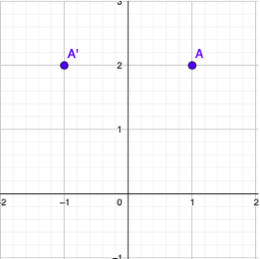
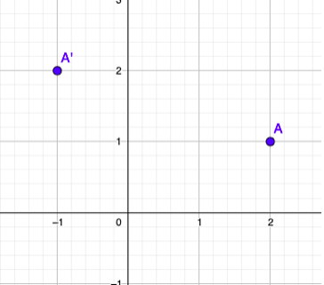

Medium

Given `n` points on a 2D plane, find if there is such a line parallel to the y-axis that reflects the given points symmetrically.

In other words, answer whether or not if there exists a line that after reflecting all points over the given line, the original points' set is the same as the reflected ones.

**Note** that there can be repeated points.

**Example 1:**

Input: points = [\[1,2],[-1,2]\]
Output: true
Explanation: We can choose the line x = 0.

**Example 2:**

Input: points = [\[2,1],[-1,2]\]
Output: false
Explanation: We can't choose a line.

**Constraints:**

- `n == points.length`
- `1 <= n <= 10⁴`
- `-10⁸ <= points[i][j] <= 10⁸`
    

**Follow up:** Could you do better than `O(n²)`?