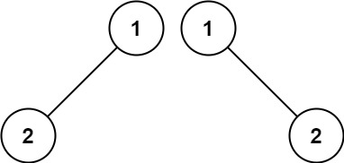

Easy

Given the roots of two binary trees `p` and `q`, write a function to check if they are the same or not.

Two binary trees are considered the same if they are structurally identical, and the nodes have the same value.

**Example 1:**

**Input:** p = [1,2,3], q = [1,2,3]
**Output:** true

**Example 2:**

**Input:** p = [1,2], q = [1,null,2]
**Output:** false

**Example 3:**

**Input:** p = [1,2,1], q = [1,1,2]
**Output:** false

**Constraints:**

- The number of nodes in both trees is in the range `[0, 100]`.
- `-104 <= Node.val <= 104`
